# ScubaShop

ScubaShop 是一個用於購買潛水裝備的電子商務網站，支持商品搜尋、篩選、分頁、以及購物車功能。以下是網站主要功能的展示。

## 功能介紹

### 1. 首頁

首頁展示了最新上架的商品，每個商品顯示了第一張圖片、名稱、價格及簡短描述。

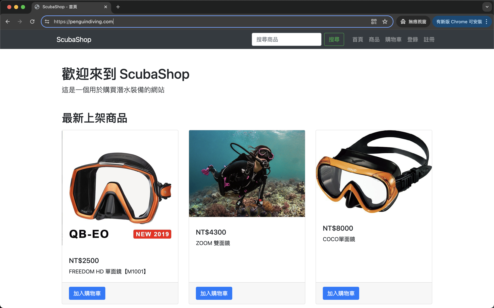

### 2. 商品篩選和排序

用戶可以根據商品類別、品牌和價格排序進行篩選。篩選條件可以通過篩選面板進行選擇。

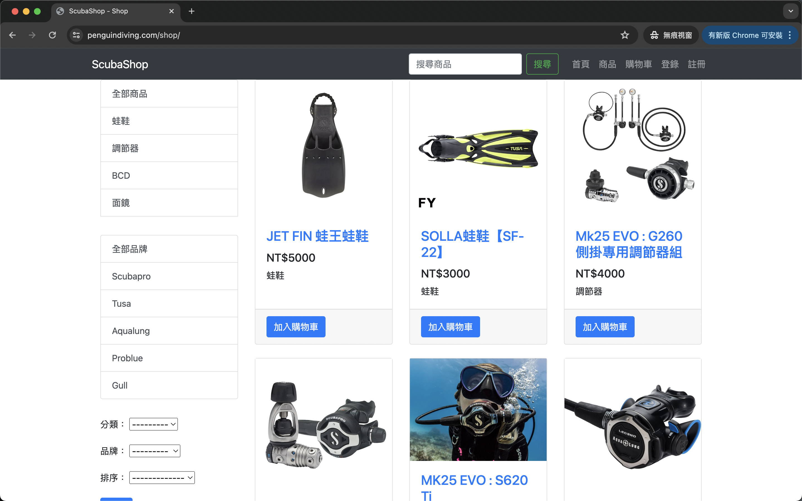

### 3. 商品詳情頁面

點擊商品卡片可以進入商品詳情頁面，顯示商品的詳細信息，包括價格、規格、描述以及更多圖片。

### 4. 搜尋功能

用戶可以通過搜尋框快速找到所需商品。搜尋結果會根據關鍵字顯示相關商品。

### 5. 購物車功能

用戶可以將商品添加到購物車，選擇數量並進行結帳。

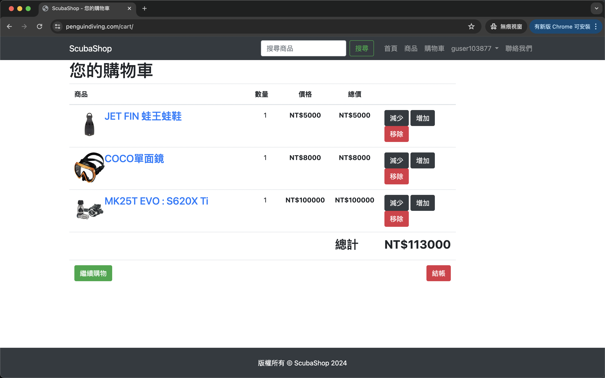

### 6. 註冊與登入

支持用戶註冊、登入、以及社交媒體第三方登入。

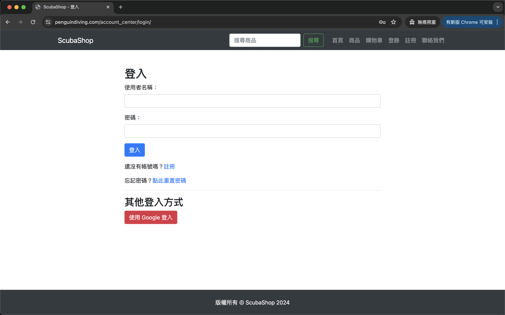

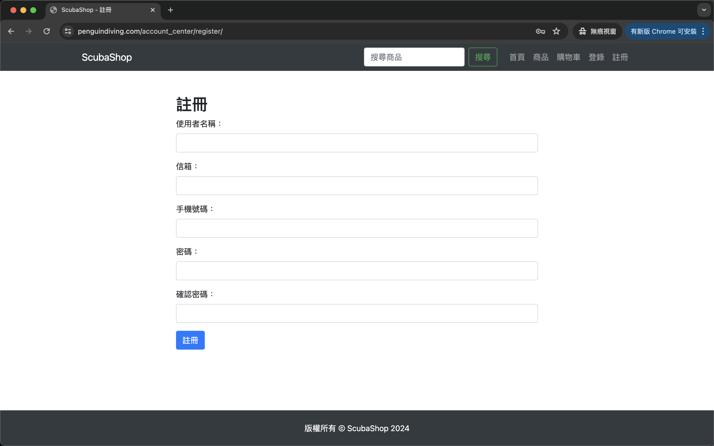

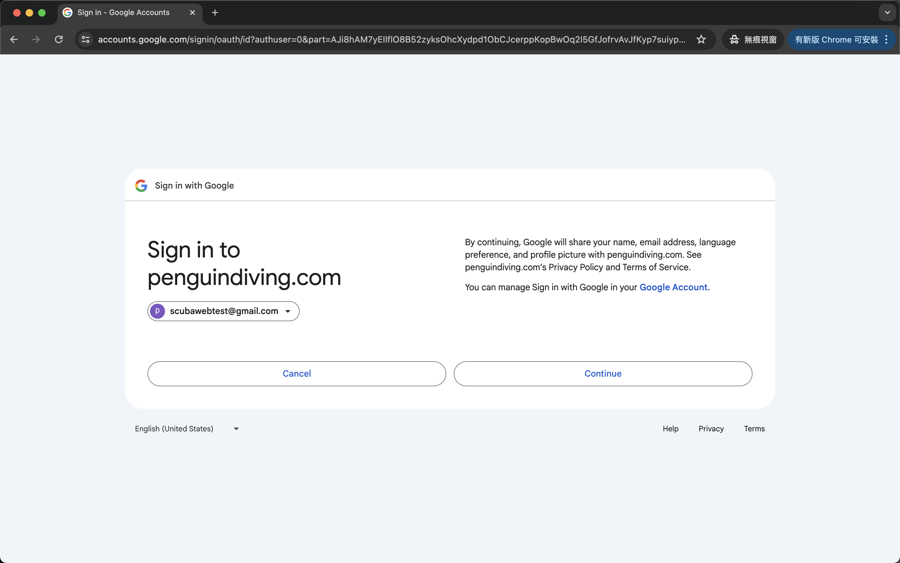

### 7. 驗證功能

非第三方登入帳號可以進行email驗證

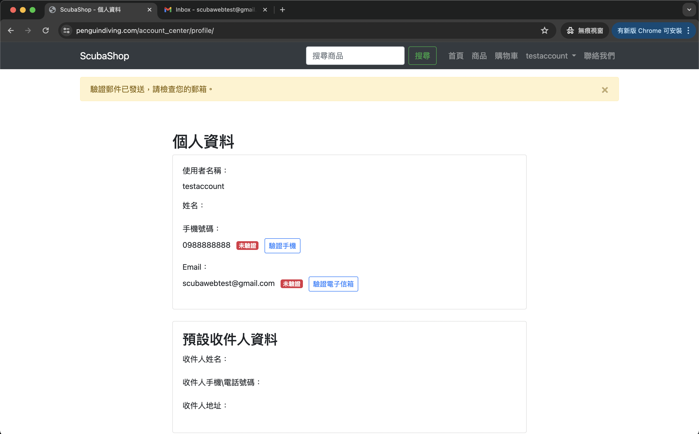

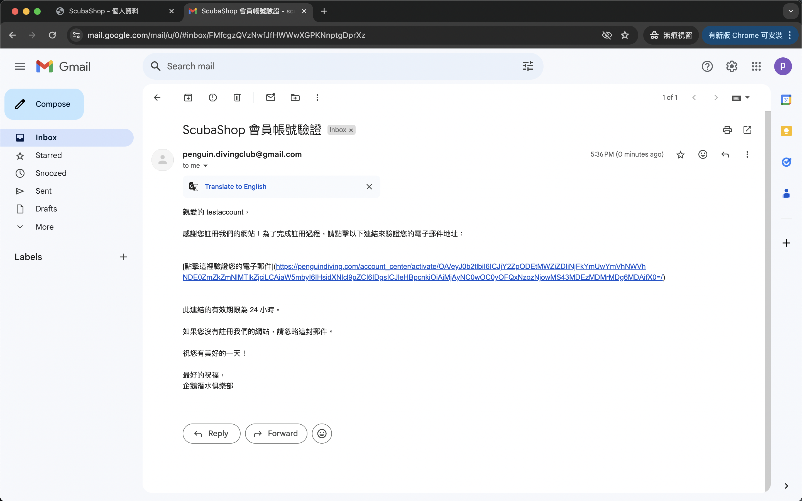

手機驗證otp驗證使用aws sns服務，目前為沙盒模式只能發送至我的手機號碼，申請生產模式審核中

### 8. 串接支付

使用paypal處理金流支付

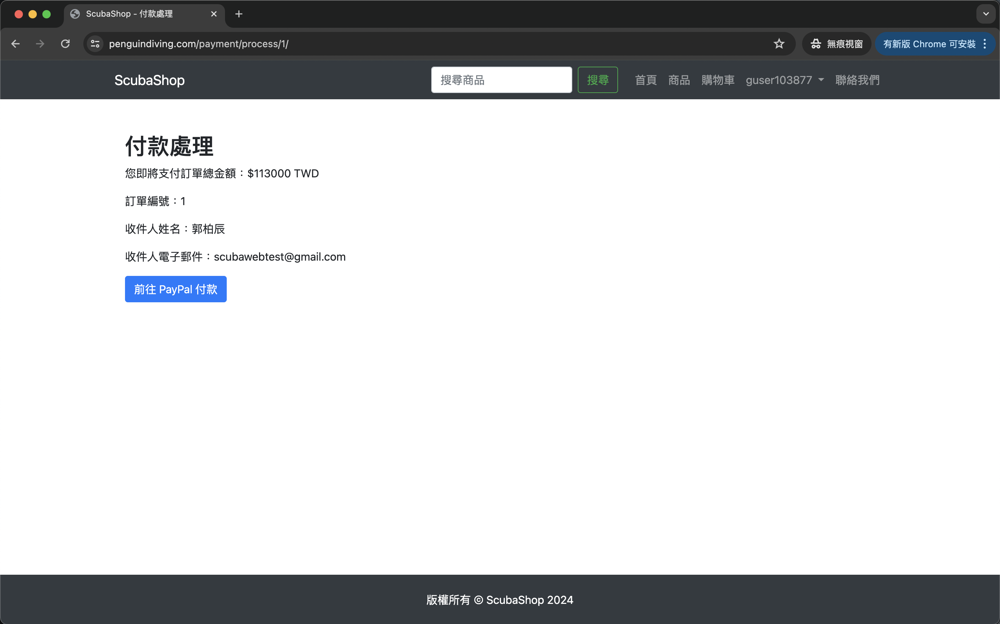

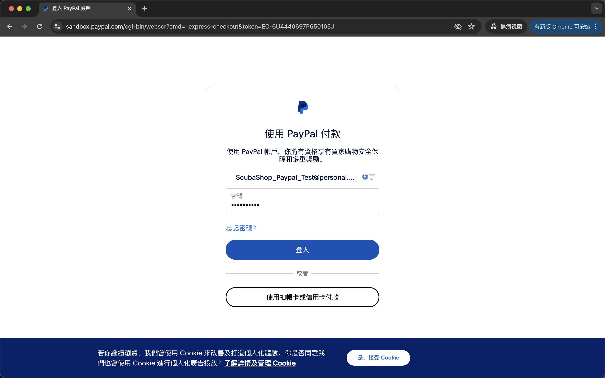

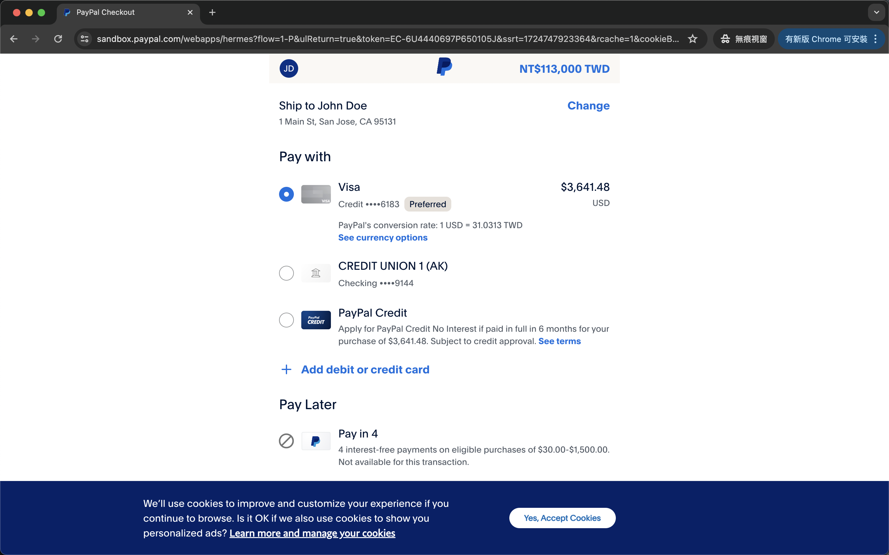

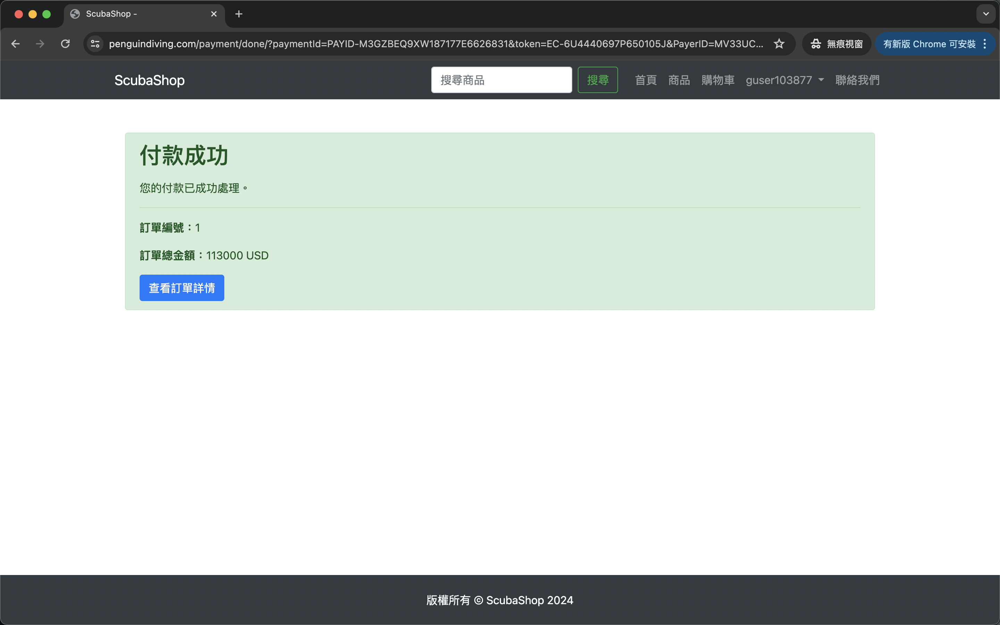

## 使用的技術

ScubaShop 使用了以下技術和服務來實現其功能：

- **Python**: 用於後端開發。
- **Django**: 作為主要的 web 框架，用於處理網站的邏輯和數據。
- **AWS EC2**: 用於網站的部署和托管。
- **AWS S3**: 用於儲存和管理靜態文件和媒體文件。
- **PayPal**: 用於處理金流和支付。
- **Swagger**: 用於 API 文檔的生成和管理，方便開發和測試 API。
- **HTTPS**: 用於網站的安全加密，確保數據傳輸的安全。

## 測試帳號

### Email 測試帳號

- **帳號**: scubawebtest@gmail.com
- **密碼**: minhax-1Nefko-murcav

### PayPal支付 測試帳號

- **帳號**: ScubaShop_Paypal_Test@personal.example.com
- **密碼**: paypaltest